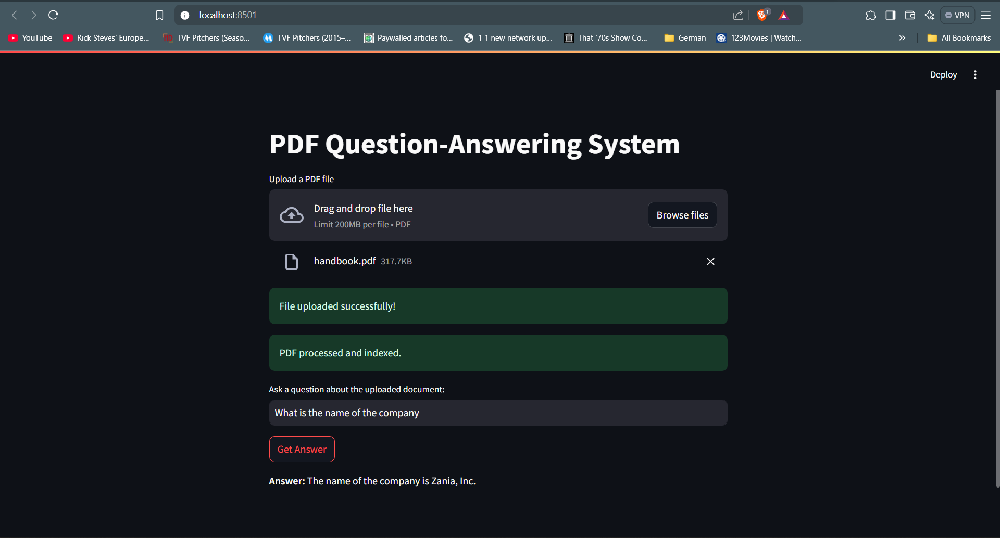
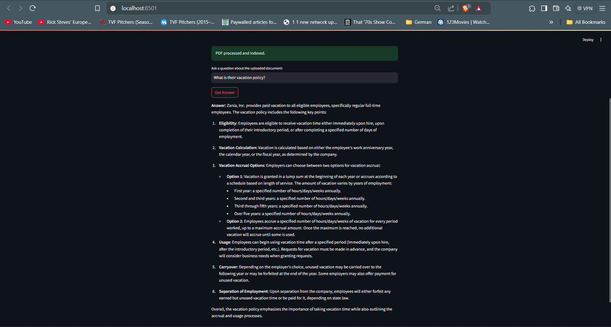

# pdfQA - Question Answering

## How to Run the Program

To set up and run the program, follow these steps:

1. **Install Necessary Libraries**  
   Run the following command to install all required libraries and dependencies:
   ```bash
   pip install -r requirements.txt

2. **Add your API key in app/openai_utils.py file**

3. **To run the web application**
    ```bash
    streamlit run main.py

## Enhancing the Solution

### Ways to Improve Accuracy
In addition to the implemented solution, there are several strategies to further improve accuracy:

- **Advanced Embedding Models**: Upgrade from `text-embedding-ada-002` to more advanced models for higher-quality embeddings.
- **Context-Aware Retrieval**: Incorporate additional context into embeddings or query expansion to better match queries with relevant chunks.
- **Metadata-Enriched Search**: Use more detailed metadata (e.g., chunk type, source) to improve search result relevance.
- **Dynamic Parameter Tuning**: Optimize parameters like `top_k` dynamically based on query complexity or user feedback.
- **Error Handling**: Add robust error handling for incomplete or low-quality embeddings and queries.
- **Normalization and Preprocessing**: Standardize input text for uniformity (e.g., case folding, punctuation removal) before embedding generation.
- **Session-Level Context**: Maintain sessions and provide context from previous conversations to better handle follow-up questions.

---

### Making the Code Modular, Scalable, and Production-Ready
To make the solution modular, scalable, and production-grade, the following practices can be adopted:

- **Configuration Management**:
  - Store API keys and other sensitive configurations securely using environment variables or secrets management tools.
- **Code Organization**:
  - Structure utility functions into separate modules (e.g., `embedding_utils`, `search_utils`) for clear responsibilities and better maintainability.
- **Dependency Injection**:
  - Pass dependencies (e.g., OpenAI clients, FAISS index) as arguments to functions or constructors to improve testability.
- **Asynchronous Execution**:
  - Use asynchronous calls for embedding generation and database queries to enhance performance.
- **Logging and Monitoring**:
  - Integrate logging for debugging purposes and monitoring tools to track system performance.
- **Version Control and Documentation**:
  - Document API usage and maintain versioning for compatibility with different system configurations and easier updates.

Example Usage:

What is the name of the company?



What is their vacation policy?


---